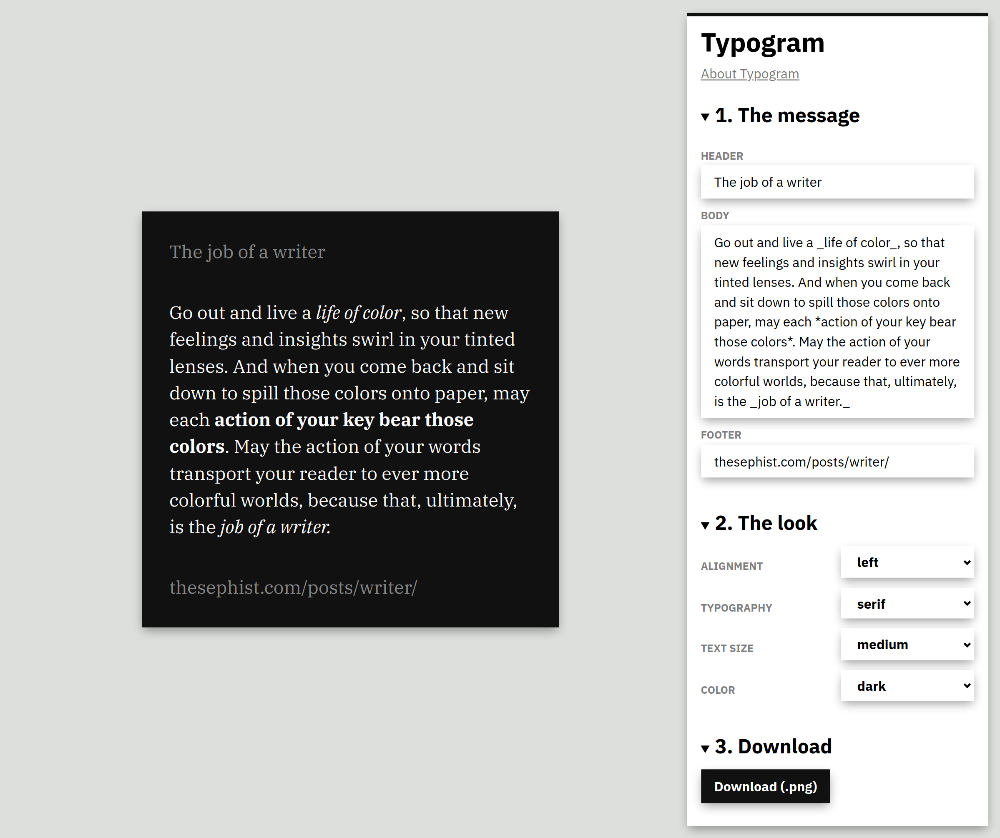

# Typogram

**Typogram** (a [portmanteau](https://en.wikipedia.org/wiki/Portmanteau) of
_typography_ and _instagram_) is a simple web app to create nice-looking,
minimalistic graphics that focus on a short snippet of text for sharing on the
web.

Typogram allows you to set optional headers and footers to anchor or attribute
a text or quote, and provides some minimal customization options for design
style. You can enter text in Slack-style Markdown format (with `*bold*` and
`_italics_`, etc.), and the parser supports a full gamut of semantic display
elements including quotes, lists, and code blocks.

Typogram is built with my homebrew web technologies:
[Torus](https://github.com/thesephist/torus) for the UI with an accompanying
[Markdown parser](https://github.com/thesephist/torus/blob/master/samples/markus/main.js),
and [paper.css](https://thesephist.github.io/paper.css/) for some style. Typogram takes after the aesthetics of my personal blogs, [thesephist.com](https://thesephist.com) and [dotink.co](https://dotink.co).

## Implementation

To **render Markdown text**, Typogram uses a simple (but sufficient)
hand-written Markdown parser in `/js/notation.js` that quickly parses a variant
of Markdown to JSON virtual DOM that Torus can efficiently render. This is
passed to Torus's rendering logic.

The graphic is initially created and previewed as normal DOM elements, scaled
to fit the editor on smaller displays. To **download/export the graphic**,
Typogram dependson [html2canvas](https://github.com/niklasvh/html2canvas) which
(mostly correctly) emulates the DOM to render an equivalent image on a canvas,
which is then converted to a PNG. There are some known bugs in html2canvas, but
I don't consider this a huge issue since screen-capturing the preview usually
also works as a workaround.

